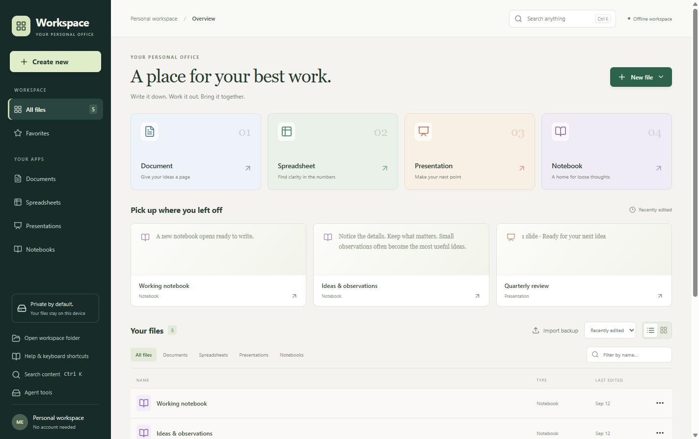
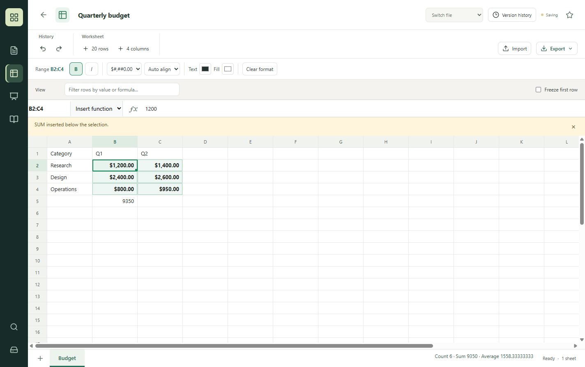

# Folio Office

**Your files. Your computer. Your choice of tools.**

An offline desktop workspace for documents, spreadsheets, presentations, and notebooks, with a shared local engine that people use through the UI and AI agents call through CLI or MCP.

[](https://github.com/shrishmanglik/folio-office/actions/workflows/ci.yml)
[](LICENSE)



## What you can do today

| App | Available now | Still to build |
| --- | --- | --- |
| Documents | Rich text, headings, lists, tables, embedded images, outline, focus mode, DOCX/HTML/TXT conversion | Tracked changes, advanced pagination, fields and mail merge |
| Spreadsheets | Multiple sheets, formulas, range selection and formatting, selection totals, summary functions, filtering, freeze first row, TSV paste, CSV/XLSX conversion | Charts, pivots, advanced data tools and broader spreadsheet UX |
| Presentations | Slide layouts, themes, images, notes, fullscreen presentation and editable PPTX export | PPTX import, animations, masters and detailed object placement |
| Notebooks | Multiple pages, search, Markdown export and semantic agent edits | Rich blocks, ink, attachments and advanced organization |
| Shared workspace | Local autosave, favorites, content search, file history, recovery and backups | Long-term version archives and remaining suite applications |

This is an early, unsigned desktop application. It does **not** yet match Microsoft Office feature coverage or exact file fidelity. Windows is the tested desktop platform. No binary release is published here yet.

## Start from source

Install Node.js 22 and npm, then:

```sh
git clone https://github.com/shrishmanglik/folio-office.git
cd folio-office
npm ci
npm run build
npm start
```

For UI development, run `npm run dev`. For tests, run `npm test`. On Windows, `npm run package` produces a portable application under the output directory specified in `electron-builder.json`. Keep an unpacked executable with all its adjacent resources.

Dependency installation needs internet access. Everyday editing and the local agent server run offline without an account or subscription.

## Use it with an AI agent

```sh
node agent/cli.cjs --workspace /absolute/path/to/workspace capabilities
node agent/cli.cjs --workspace /absolute/path/to/workspace exec --file /absolute/path/to/command.json
```

Example command:

```json
{
  "operation": "file.create",
  "kind": "document",
  "name": "Project brief",
  "requestId": "brief-create-001"
}
```

The CLI exposes typed discovery, dry-run previews, semantic edits, import/export, search and recovery. Mutations use revision checks and request IDs so a human and an agent can work on the same local files without silently overwriting each other.

For MCP, run the same entry point with `mcp` instead of `capabilities`. The desktop's **Agent tools** panel provides a configuration with your actual local paths. See [agent setup and examples](docs/AGENT-QUICKSTART.md).

## Spreadsheet workflow

Version 0.7 adds Fill down/right, selective clearing, record sorting and worksheet rename, duplicate, reorder and deletion. These operations share their implementation with the `spreadsheet.edit` agent command. Formula-containing sorts and unsupported reference forms return clear errors. The [execution state](docs/EXECUTION-STATE.json) tracks the remaining catalog scope.


Enter a range such as `B2:C4` in the name box or Shift-click its corners. Apply formatting to the selection, copy or clear the range, inspect count/sum/average, or insert a summary formula below it. Shift+Arrow extends the selection. Formula insertion refuses to overwrite an occupied destination.



See the [validation record](docs/VALIDATION.md) for tested workflows and remaining coverage.

## File safety and compatibility

Workspace data is plaintext JSON stored locally, including embedded images. Open **Open workspace folder** in the app to find it. History is bounded to 30 versions per file within a shared 20 MB budget; keep separate backups for important work.

Desktop network requests are blocked. Import/export commands can access the explicit paths you provide; the workspace path is not a filesystem sandbox. Conversion supports a documented subset of each format. Review [file fidelity and limits](docs/FILE-FIDELITY.md) before round-tripping important files.

## Open source and licensing

Folio Office's original source is licensed under **Apache License 2.0**. See [LICENSE](LICENSE) and [NOTICE](NOTICE).

Third-party code retains its own licenses and notices. The current formula adapter uses MIT-licensed fast-formula-parser instead of the former GPLv3 HyperFormula dependency. See [third-party notices](THIRD_PARTY_NOTICES.md), including the unresolved license metadata on one legacy transitive dependency. Source publication does not constitute a binary-distribution license clearance.

Folio Office is an independent project by The AGI Studio. It is not affiliated with or endorsed by Microsoft.

## Contribute

Start with [CONTRIBUTING.md](CONTRIBUTING.md), [the roadmap](docs/ROADMAP.md), and [open issues](https://github.com/shrishmanglik/folio-office/issues). Report vulnerabilities privately using [SECURITY.md](SECURITY.md).

Pull requests describe the user-facing change and actual validation. Each merged pull request receives an automated summary with its merge commit and checks link. The initial source import is a commit, not a fabricated historical PR or merge.

### Spreadsheet formatting and transfer

The Formatting panel adds font family/size, underline, strike, wrap, vertical alignment, indent, rotation and border presets. Copy range to... supports calculated values, formulas, formatting, transposition and skip blanks across worksheets. Fill works in four directions; Find & replace edits literal text in the selection. All edits use shared local logic and support undo. These are bounded capabilities; full 165-family acceptance is tracked in [the execution register](docs/EXECUTION-STATE.json).
