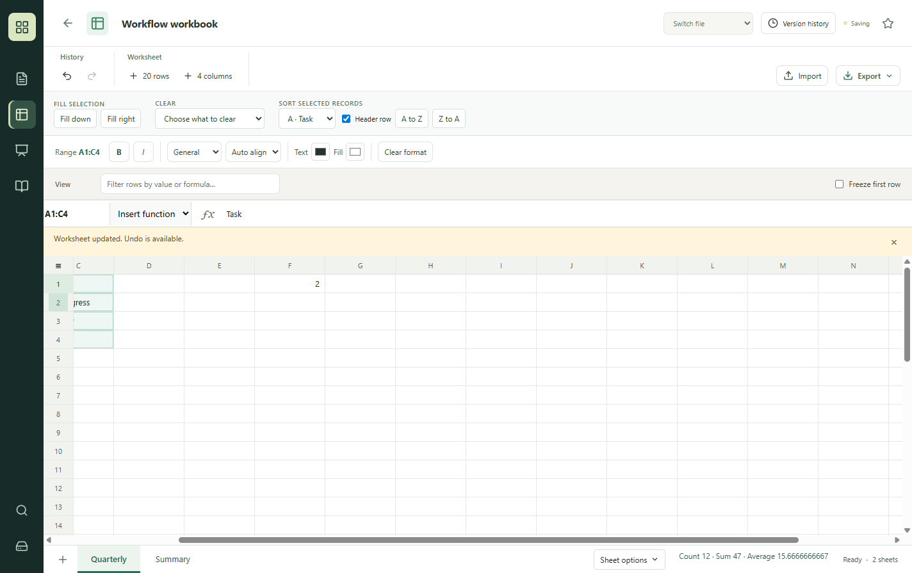
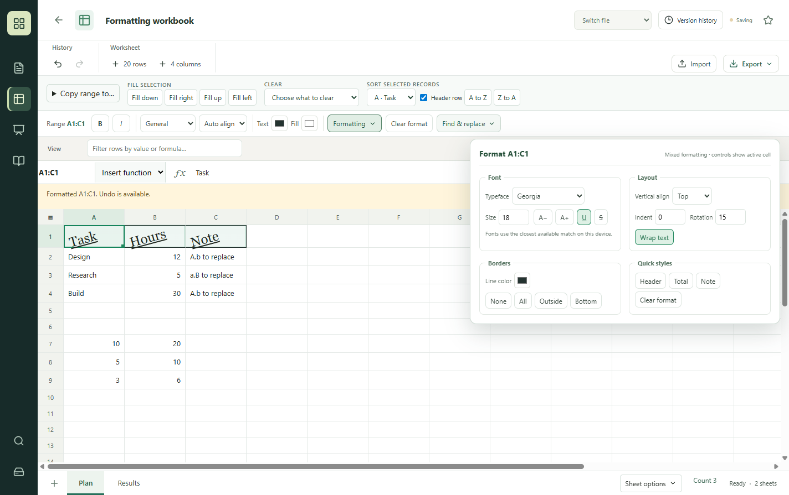

# Validation record: 0.6.0 source preview

Validated locally on Windows using synthetic data in a temporary profile. This is task-based automated validation, not feedback from recruited users and not a claim to have tested every Office feature.

| Viewpoint | Task | Result |
| --- | --- | --- |
| Finance user | Select six cells, apply bold/currency, read sum 9350 | Passed in actual Electron renderer |
| Everyday spreadsheet user | Insert SUM below the selected range | Passed; result 9350 |
| Keyboard user | Extend selection with Shift+ArrowDown | Passed |
| Recovery user | Delete a range and undo | Passed |
| AI agent | Read saved range styles and formula through the shared engine | Passed |
| Formula consumer | Financial/logical/lookup formulas, quoted cross-sheet references, cycles, errors, network-function rejection | Passed in automated fixtures |
| Contributor | Install, tests and build | Initial GitHub CI completed actual steps; later runs are linked from each PR |

The current automated suite contains 34 tests. `npm test` and `npm run build` passed locally. `node scripts/native-spreadsheet.cjs` exercises the native flows above and writes evidence locally. No renderer exceptions were observed in that run.

A rendered screenshot exposed double-encoded toolbar glyphs. The source was corrected and a source-encoding regression check now rejects the known corruption sequences.

## Limits

Local Excel 16.0.20326.20132 was opened. The Windows helper returned an Excel accessibility tree with a screenshot of another app, so further input was stopped. A complete local Excel ribbon inventory and task comparison are **not complete**.

Advanced spreadsheet tools, assistive-technology testing, large-workbook stress, full Office fidelity, an independent release review and clean-machine installer acceptance remain open. Existing document, presentation, notebook, storage, conversion and agent tests do not amount to testing from every possible user viewpoint.

The source no longer depends on HyperFormula. The MIT replacement has bounded compatibility fixtures, not exhaustive equivalence. `buffers@0.1.1` licensing remains unresolved; no public binary release is provided.

## 0.7.0 Home increment

43 local automated tests passed on Windows, including a synthetic Windows lock-contention control. Source Electron acceptance passed seven workflow groups: reference-aware fill with formatting, record sort, selective clear and undo, sheet management, row selection, agent readback, and saved-file reopening through the shared engine. No renderer exceptions were observed. Run `node scripts/native-home-workflows.cjs` for this fixture.

Independent bounded review found and rechecked fixes for quoted sheet identifiers and a deletion-reference sentinel collision. It did not approve the entire release. Native inspection also caught a worksheet menu clipped behind the grid; the footer stacking and overflow were corrected and the workflow rerun passed.

Unsupported formula sorts/reference forms remain explicit failures. The full165-entry campaign is tracked in EXECUTION-STATE.json. No full Office parity, independent whole-release approval or public binary clearance is claimed.

## 0.8.0 Formatting and transfer increment

Run `node scripts/native-formatting-workflows.cjs` for six synthetic native Electron workflow groups: rendered formatting, fill up, calculated/transposed range copy between sheets, literal replacement with undo/redo, agent readback, and a real desktop restart after an agent formatting edit. The previous seven-group Home regression also remains required. `tests/cell-styles-xlsx.test.cjs` reads an actual XLSX file back to check styles on populated and blank cells.

Independent bounded review found calculated text being reinterpreted during values-only copy. Regression controls now preserve formula-like text, decimal text, booleans-as-text, apostrophes, error-like text, long identifiers and empty strings. The review covered these code paths, not the whole 165-family catalog or final release.

Known limitations include formula-containing sorts, rich system clipboard/cut semantics, font availability detection, full border variants, custom format authoring, date serial preservation on XLSX reimport, large-workbook performance, and accessibility acceptance. These remain tracked in EXECUTION-STATE.json. Dependency audit and binary licensing findings remain unresolved.
